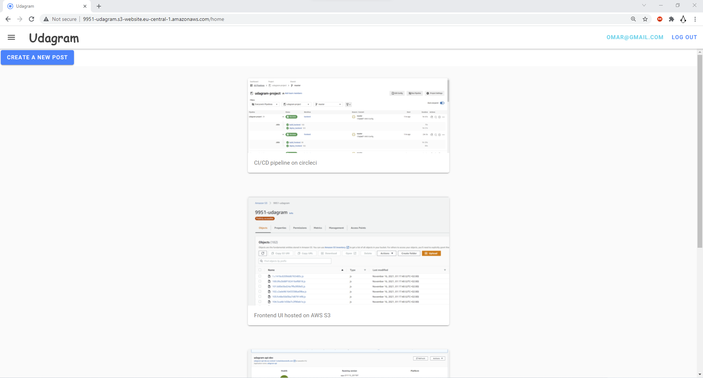
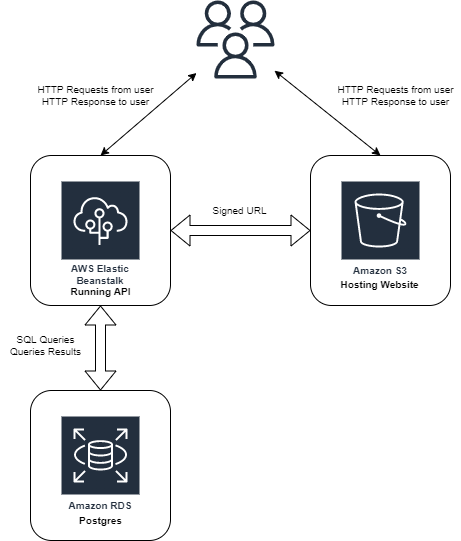
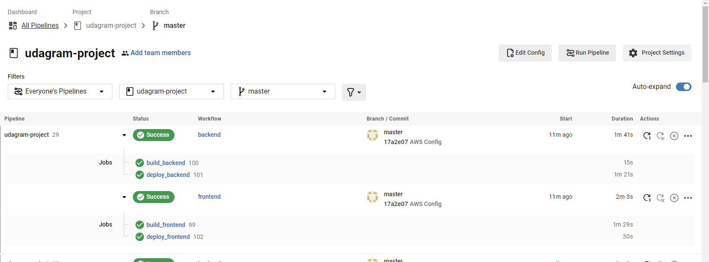
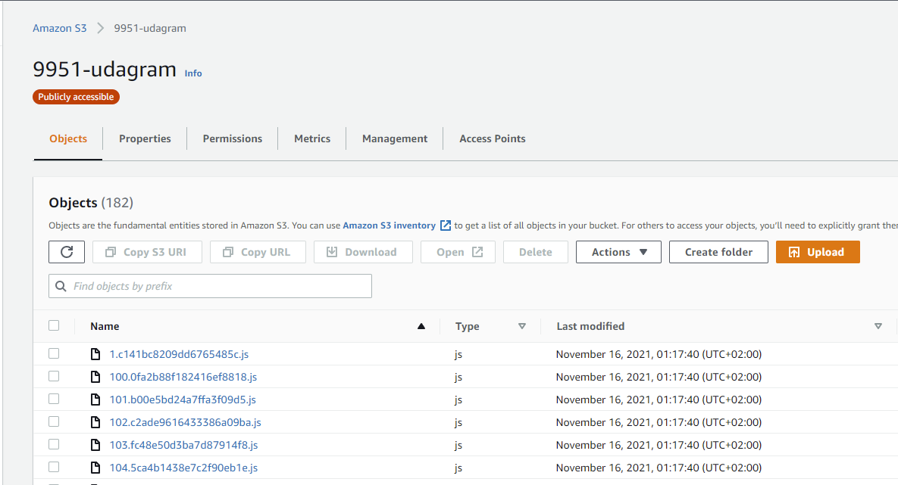

# Udagram [](https://app.circleci.com/pipelines/github/omarghatrify/udagram-project)

This application is provided to you as an alternative starter project if you do not wish to host your own code done in the previous courses of this nanodegree. The udagram application is a fairly simple application that includes all the major components of a Full-Stack web application.

Working webapp at: [S3 Bucket Public-Read Static Website](http://9951-udagram.s3-website.eu-central-1.amazonaws.com/)


## Infrastructure


### Pipline:  
[](https://app.circleci.com/pipelines/github/omarghatrify/udagram-project)




### Elastic Beanstalk:


### AWS RDB - Postgres:


### S3 Bucket:  



## Getting Started

### Dependencies

```
- Node v14.15.1 (LTS) or more recent. While older versions can work it is advisable to keep node to latest LTS version

- npm 6.14.8 (LTS) or more recent, Yarn can work but was not tested for this project

- AWS CLI v2, v1 can work but was not tested for this project

- Elastic Beanstalk CLI

- A RDS database running Postgres.

- A S3 bucket for hosting uploaded pictures.

```

### Installation

Provision the necessary AWS services needed for running the application:

1. RDS Configuration [Here](./docs/01-RDS%20Setup.md)
2. Backend Configuration [Here](./docs/02-Backend%20Setup.md)
3. Frontend Configuration [Here](./docs/03-Frontend%20Setup.md)
4. Circleci Configuration [Here](./docs/04-Pipeline%20Setup.md)

## Built With

- [Angular](https://angular.io/) - Single Page Application Framework
- [Node](https://nodejs.org) - Javascript Runtime
- [Express](https://expressjs.com/) - Javascript API Framework

## License

[License](LICENSE.txt)
