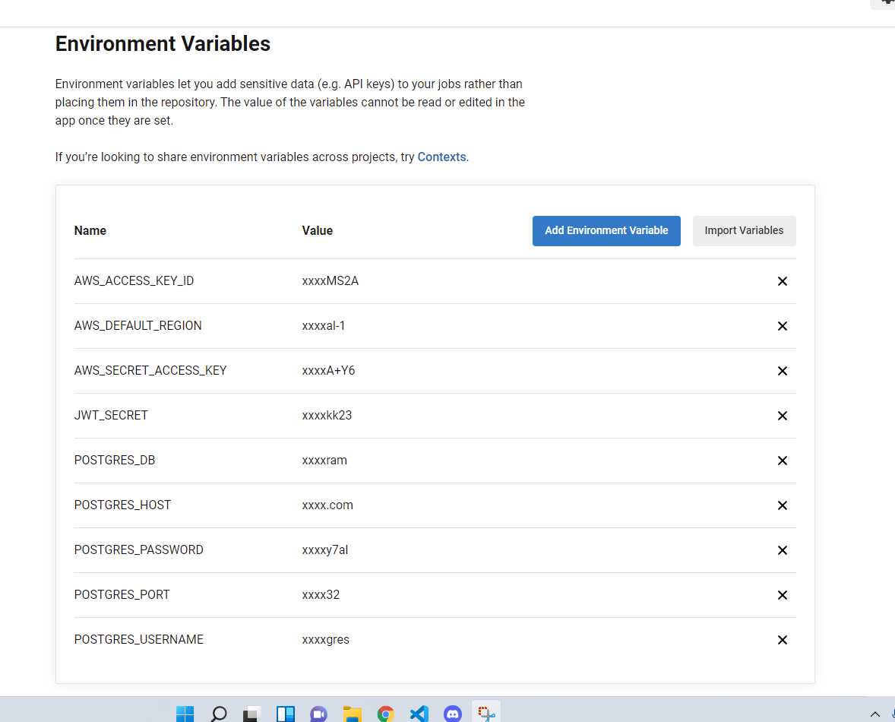

# Circleci Pipeline


## Setup

1. Edit the `config.yml` file in `.circleci` directory change the `bucket`, `app-name`, `env-name`, `region_name`.  
      ```yaml
      deploy_frontend:
        bucket: "s3://BUCKET_NAME/"
        requires:
          - build_frontend
      ``` 
      ```yaml
      deploy_backend:
          requires:
            - build_backend
          app-name: "EB_APP_NAME"
          env-name: "EB_ENV_NAME"
          region-name: "AWS_REGION"
      ```
2. Link your git repository with circleci
3. Open circleci project > project settings > enviroment variables and add the required variables:
   - AWS_ACCESS_KEY_ID
   - AWS_DEFAULT_REGION
   - AWS_SECRET_ACCESS_KEY

